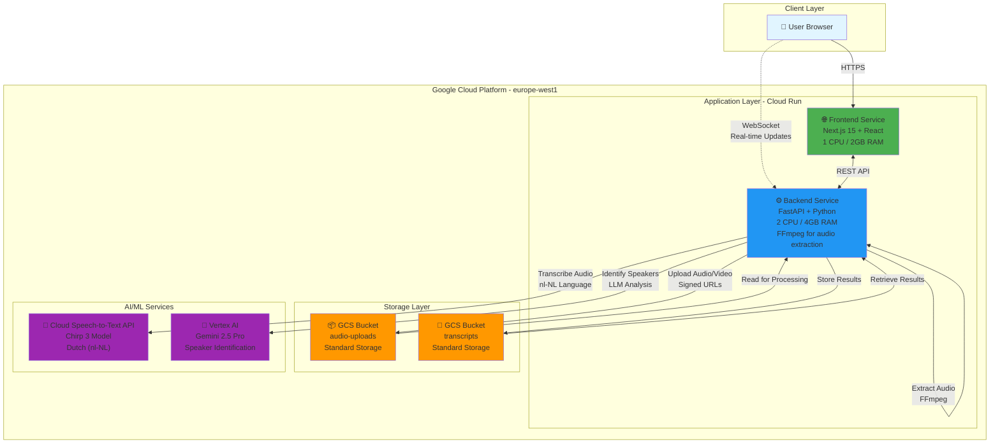
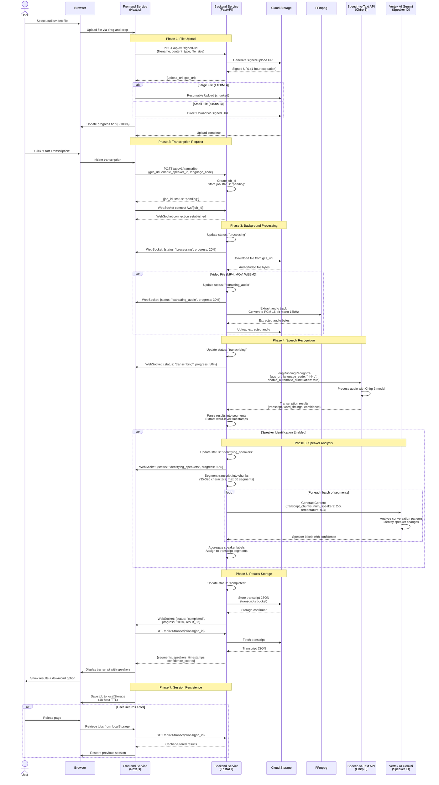

# DevoTranscribe Architecture

This document provides comprehensive architectural diagrams for the DevoTranscribe speech-to-text platform, built with Next.js, FastAPI, and Google Cloud Platform.

---

## 1. High-Level Architecture Overview

This diagram shows the main runtime components and data flow of the DevoTranscribe platform.

**Key Components:**
- **Frontend**: Serverless Next.js application handling UI, file uploads, and real-time progress display
- **Backend**: Async FastAPI service orchestrating transcription pipeline, WebSocket connections, and AI service integration
- **Cloud Storage**: Two buckets for uploaded files and completed transcripts
- **Speech-to-Text API**: Google's Chirp 3 model for high-accuracy Dutch transcription
- **Vertex AI Gemini**: Advanced LLM for intelligent speaker identification
- **FFmpeg**: Embedded in backend for automatic audio extraction from video files

---

## 2. Detailed System Architecture (Including CI/CD)

This comprehensive diagram includes the full development and deployment pipeline alongside runtime components.

```mermaid
graph TB
    subgraph "Development"
        Dev[👨‍💻 Developer]
        Git[📚 Git Repository<br/>GitHub]
    end

    subgraph "Google Cloud Platform - Project ID"
        subgraph "CI/CD Pipeline"
            CloudBuild["🔨 Cloud Build<br/>Build Triggers<br/>E2_HIGHCPU_8"]
            ArtifactRegistry["📦 Artifact Registry<br/>europe-west1-docker.pkg.dev<br/>Container Images"]
            Terraform["🏗️ Terraform<br/>Infrastructure as Code<br/>Cloud Run + Storage + Build"]
        end

        subgraph "europe-west1 Region"
            subgraph "Cloud Run Services"
                FrontendService["🌐 Frontend<br/>speech-frontend<br/>Next.js Container<br/>Min: 0 | Max: 10<br/>Concurrency: 100"]
                BackendService["⚙️ Backend<br/>speech-backend<br/>FastAPI Container<br/>Min: 1 | Max: 10<br/>Timeout: 3600s"]
            end

            subgraph "Cloud Storage Buckets"
                UploadBucket["📤 audio-uploads<br/>5GB limit<br/>Uniform Access<br/>Lifecycle: 7 days"]
                TranscriptBucket["📥 transcripts<br/>Processed Results<br/>Uniform Access"]
            end

            subgraph "Identity & Access"
                FrontendSA["🔐 Frontend SA<br/>Storage Object Creator"]
                BackendSA["🔐 Backend SA<br/>Storage Admin<br/>Speech Client<br/>Vertex AI User"]
            end
        end

        subgraph "AI Services - Multi-Region"
            SpeechV2["🎤 Speech-to-Text v2<br/>Chirp 3 Model<br/>nl-NL Configuration<br/>Auto Punctuation"]
            Gemini["🤖 Vertex AI Gemini 2.5 Pro<br/>Temperature: 0.3<br/>Speaker Analysis<br/>2-10 Speakers"]
        end

        subgraph "Monitoring & Logging"
            CloudLogging["📊 Cloud Logging<br/>Application Logs"]
            HealthChecks["💓 Health Checks<br/>/ endpoint every 30s"]
        end
    end

    subgraph "Users"
        Browser["🌐 Web Browser<br/>Desktop/Mobile"]
    end

    Dev -->|"git push"| Git
    Git -->|"Webhook Trigger"| CloudBuild
    CloudBuild -->|"Build Docker Images"| ArtifactRegistry
    CloudBuild -->|"Deploy Containers"| FrontendService
    CloudBuild -->|"Deploy Containers"| BackendService
    Terraform -.->|"Provision & Configure"| FrontendService
    Terraform -.->|"Provision & Configure"| BackendService
    Terraform -.->|"Create Buckets"| UploadBucket
    Terraform -.->|"Create Buckets"| TranscriptBucket
    Terraform -.->|"Create & Bind"| FrontendSA
    Terraform -.->|"Create & Bind"| BackendSA
    Terraform -.->|"Configure Triggers"| CloudBuild

    Browser -->|"HTTPS Requests"| FrontendService
    Browser -.->|"WebSocket /ws/{job_id}"| BackendService
    FrontendService -->|"API Calls"| BackendService
    FrontendService -.->|"Uses Identity"| FrontendSA
    BackendService -.->|"Uses Identity"| BackendSA
    BackendService -->|"Signed URLs<br/>Upload/Download"| UploadBucket
    BackendService -->|"Store Transcripts"| TranscriptBucket
    BackendService -->|"Transcribe Request<br/>Long-Running Recognize"| SpeechV2
    BackendService -->|"Speaker ID Request<br/>GenerateContent"| Gemini

    FrontendService -->|"Logs"| CloudLogging
    BackendService -->|"Logs"| CloudLogging
    HealthChecks -->|"Check"| FrontendService
    HealthChecks -->|"Check"| BackendService

    style Dev fill:#e1f5ff
    style Git fill:#f0f0f0
    style CloudBuild fill:#4CAF50
    style ArtifactRegistry fill:#FF9800
    style Terraform fill:#7B1FA2
    style FrontendService fill:#4CAF50
    style BackendService fill:#2196F3
    style UploadBucket fill:#FF9800
    style TranscriptBucket fill:#FF9800
    style FrontendSA fill:#FFC107
    style BackendSA fill:#FFC107
    style SpeechV2 fill:#9C27B0
    style Gemini fill:#9C27B0
    style CloudLogging fill:#607D8B
    style HealthChecks fill:#607D8B
    style Browser fill:#e1f5ff
```

**Infrastructure Details:**

**Cloud Run Configuration:**
- **Frontend**: Scales to zero when idle, handles static assets and Next.js SSR
- **Backend**: Always-warm (min 1 instance), handles long-running transcription jobs up to 1 hour

**CI/CD Pipeline:**
- Automated builds triggered on git push
- Multi-stage Docker builds with UV package manager (backend) and Next.js standalone mode (frontend)
- Deployment to Cloud Run with zero-downtime rolling updates

**Security:**
- Service accounts with least-privilege IAM roles
- Signed URLs for secure file uploads (1-hour expiration)
- CORS configured per environment
- Non-root containers (UID 1001)

**Storage:**
- Audio uploads bucket: 7-day lifecycle policy for automatic cleanup
- Transcripts bucket: Persistent storage for completed transcriptions
- Uniform bucket-level access for simplified IAM

---

## 3. User Flow Sequence Diagram

This diagram illustrates the complete journey from file upload to receiving a transcription with speaker identification.

**Flow Phases:**

1. **File Upload** (0-100% of upload progress)
   - Request signed URL from backend
   - Upload directly to GCS using signed URL (resumable for large files)
   - No file data passes through backend (efficient for large files)

2. **Transcription Request**
   - Create job with unique ID
   - Establish WebSocket for real-time updates
   - Return immediately (async processing)

3. **Background Processing**
   - Download file from GCS
   - Extract audio if video format (FFmpeg)
   - Update status via WebSocket

4. **Speech Recognition**
   - Call Speech-to-Text API with Chirp 3
   - Automatic Dutch language processing
   - Word-level timing and confidence scores

5. **Speaker Analysis** (Optional)
   - Segment transcript intelligently (35-320 chars)
   - Batch process with Gemini (up to 60 segments/request)
   - Maintain speaker consistency across conversation

6. **Results Storage**
   - Save to GCS transcripts bucket
   - Cache in backend memory
   - Send completion event via WebSocket

7. **Session Persistence**
   - Store job metadata in browser localStorage
   - 48-hour TTL for automatic cleanup
   - Restore sessions across browser reloads

**Timing Estimates:**
- Upload: Varies by file size and connection (5MB = ~10s, 500MB = ~5 min)
- Audio Extraction: ~10-30 seconds for typical video files
- Transcription: ~1/3 to 1/2 of audio duration (30-min audio = ~10-15 min processing)
- Speaker ID: ~2-5 seconds per minute of audio
- **Total**: 5-minute audio typically processes in 3-5 minutes end-to-end

---

## Technology Stack Summary

| Layer | Technology | Purpose |
|-------|-----------|---------|
| **Frontend** | Next.js 15 + React 18 | Server-side rendering and modern UI |
| **Frontend Styling** | Tailwind CSS 3.4 | Responsive, utility-first styling |
| **Frontend State** | SWR + Custom Hooks | Data fetching and state management |
| **Backend** | FastAPI 0.115 | High-performance async API framework |
| **Backend Language** | Python 3.11+ | Core business logic and AI integration |
| **Package Manager** | UV (Rust-based) | Ultra-fast Python dependency resolution |
| **Audio Processing** | FFmpeg | Audio extraction and format conversion |
| **Transcription** | Google Cloud Speech-to-Text v2 (Chirp 3) | State-of-the-art multilingual speech recognition |
| **Speaker ID** | Google Vertex AI Gemini 2.5 Pro | Advanced LLM for conversation analysis |
| **Storage** | Google Cloud Storage | Scalable object storage for audio/transcripts |
| **Hosting** | Google Cloud Run | Serverless container platform |
| **CI/CD** | Cloud Build | Automated build and deployment |
| **IaC** | Terraform | Infrastructure as code |
| **Containerization** | Docker | Application packaging and isolation |
| **Real-time** | WebSockets | Live progress updates to frontend |
| **API Docs** | OpenAPI/Swagger | Interactive API documentation |
| **Monitoring** | Cloud Logging | Centralized application logging |

---

## Architecture Principles

**Cloud-Native**: Built for the cloud from day one, leveraging serverless architecture for automatic scaling and cost efficiency.

**Async-First**: FastAPI and Python asyncio enable efficient handling of long-running transcription jobs without blocking.

**API-Driven**: Clean REST API design enables future integrations and client applications beyond the web interface.

**Separation of Concerns**: Frontend handles presentation, backend orchestrates business logic, cloud services provide specialized capabilities.

**Infrastructure as Code**: Terraform manages all infrastructure, ensuring reproducible deployments and version-controlled infrastructure.

**Security by Design**: Service accounts with least privilege, signed URLs for time-limited access, non-root containers, and CORS protection.

**Developer Experience**: Type safety (TypeScript + Pydantic), automated testing, hot reload in development, comprehensive API documentation.

**Observability**: Structured logging, health checks, and Cloud Monitoring integration for production visibility.

---

**Last Updated**: 2025
**Architecture Version**: 1.0
**Built by**: Joshua Vink | Devoteam
