# DevoTranscribe - Instruction Manual

**Professional Speech Transcription Service**

---

## Table of Contents

- [DevoTranscribe - Instruction Manual](#devotranscribe---instruction-manual)
  - [Table of Contents](#table-of-contents)
  - [1. Overview](#1-overview)
  - [2. Getting Started](#2-getting-started)
    - [Supported File Formats](#supported-file-formats)
  - [3. Transcription Configuration](#3-transcription-configuration)
    - [Available Options](#available-options)
  - [4. Uploading a File](#4-uploading-a-file)
    - [How to Upload](#how-to-upload)
  - [5. Upload Progress](#5-upload-progress)
  - [6. Transcription Processing](#6-transcription-processing)
  - [7. Viewing Results](#7-viewing-results)
    - [Result Header](#result-header)
    - [Original vs. Refined Transcript](#original-vs-refined-transcript)
  - [8. Transcript Segments](#8-transcript-segments)
  - [9. Speaker Identification](#9-speaker-identification)
    - [Speaker Transcript Actions](#speaker-transcript-actions)
  - [10. Downloading and Copying Transcripts](#10-downloading-and-copying-transcripts)
    - [Copy to Clipboard](#copy-to-clipboard)
    - [Download as Text File](#download-as-text-file)
    - [Job Metadata](#job-metadata)
  - [11. Starting a New Transcription](#11-starting-a-new-transcription)
  - [12. Support \& Legal Pages](#12-support--legal-pages)
    - [Privacy Policy](#privacy-policy)
    - [Terms of Service](#terms-of-service)
    - [Support](#support)
  - [13. Troubleshooting](#13-troubleshooting)
    - [Common Issues](#common-issues)
    - [Browser Requirements](#browser-requirements)

---

## 1. Overview

DevoTranscribe is a professional speech transcription service that converts audio and video files into accurate text transcriptions. The service is powered by Google Cloud AI and features:

- **Fast Upload** - Upload audio and video files up to 5GB with progress tracking
- **AI-Powered Transcription** - High-quality speech transcription using Google Cloud Speech-to-Text
- **Speaker Identification** - AI-powered speaker detection for Dutch conversations using Gemini LLM
- **Refined Transcripts** - Light LLM cleanup for improved readability

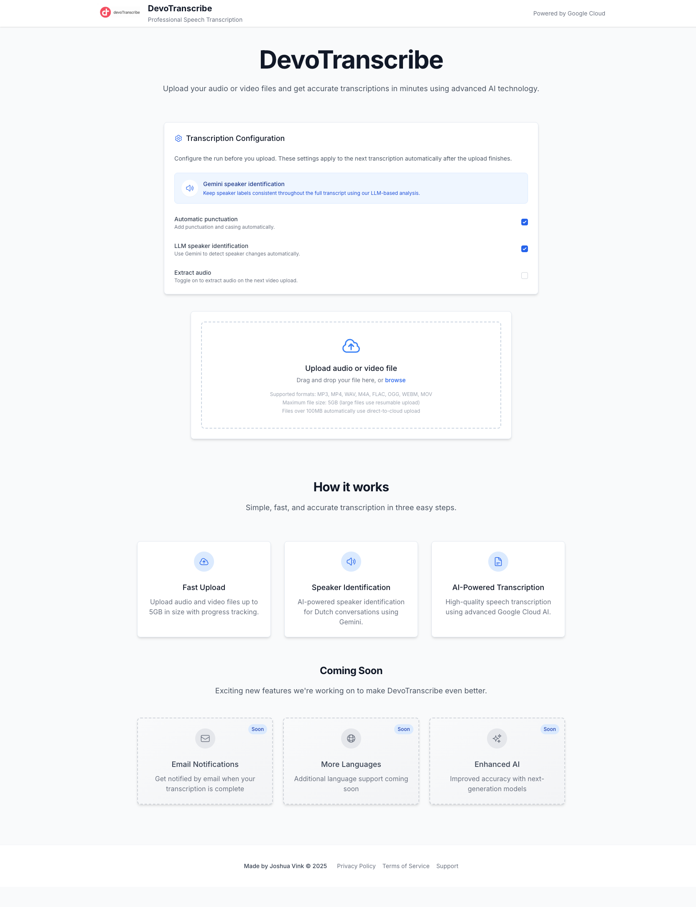

---

## 2. Getting Started

When you open DevoTranscribe, you will see the main page with:

- A **header** displaying the DevoTranscribe logo and "Powered by Google Cloud" branding
- The **hero section** with the title and a brief description
- The **Transcription Configuration** panel
- The **file upload** area
- **How it works** and **Coming Soon** feature cards

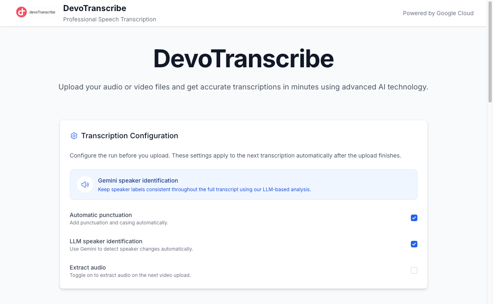

### Supported File Formats

| Type | Formats |
|------|---------|
| Audio | MP3, WAV, M4A, FLAC, OGG, WEBM |
| Video | MP4, MOV, AVI, MKV, WEBM |

**Maximum file size:** 5GB. Files over 100MB automatically use direct-to-cloud upload for reliable transfer.

---

## 3. Transcription Configuration

Before uploading a file, configure the transcription settings in the **Transcription Configuration** panel. These settings are applied automatically once the upload completes.

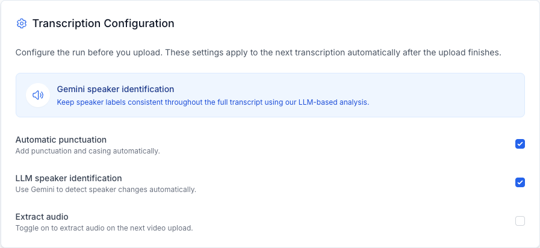

### Available Options

| Setting | Default | Description |
|---------|---------|-------------|
| **Gemini speaker identification** | Always on | Uses LLM-based analysis to keep speaker labels consistent throughout the full transcript. This is a core feature and is always enabled. |
| **Automatic punctuation** | Enabled | Adds punctuation and casing automatically to the transcribed text. |
| **LLM speaker identification** | Enabled | Uses Google Gemini to detect speaker changes automatically within the audio. |
| **Extract audio** | Disabled (auto-enabled for video) | Extracts audio from video files before transcribing. Automatically enabled when you upload a video file. |

> **Note:** Configuration options are disabled (greyed out) while a file is uploading or a transcription is in progress. Adjust settings before starting an upload.

---

## 4. Uploading a File

To upload a file, use the upload area below the configuration panel.

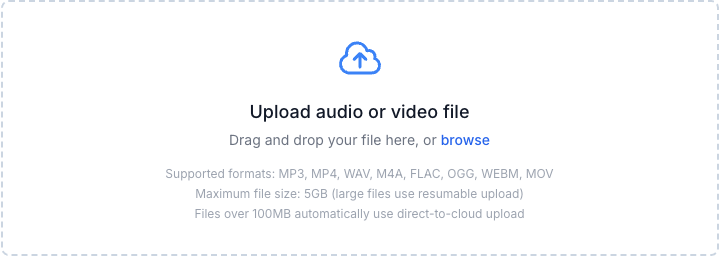

### How to Upload

There are two ways to upload a file:

1. **Drag and drop** - Drag your audio or video file directly onto the upload area
2. **Browse** - Click anywhere on the upload area or click "browse" to open a file picker dialog

Once a file is selected, the upload begins immediately and the transcription will start automatically after the upload completes.

> **Tip:** If you upload a video file (e.g., MP4), the "Extract audio" option is automatically enabled to convert the video to audio before transcription.

---

## 5. Upload Progress

After selecting a file, a progress bar shows the upload status in real time.

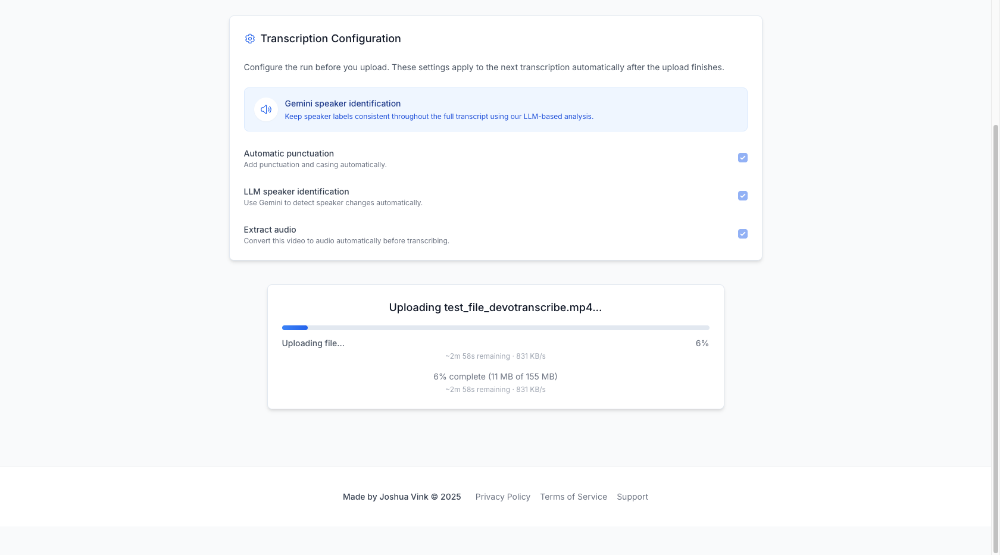

The upload progress card displays:

- **File name** being uploaded
- **Progress bar** with percentage
- **Upload speed** (e.g., 702 KB/s)
- **Estimated time remaining** (e.g., ~2m 20s remaining)
- **Bytes transferred** (e.g., 59 MB of 155 MB)

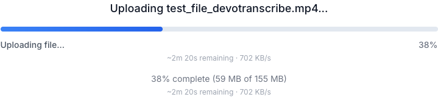

> **Note:** Large files (over 100MB) use resumable upload technology, ensuring reliable transfers even on slower connections.

---

## 6. Transcription Processing

Once the upload completes, the transcription begins automatically. The progress bar updates to show the current processing stage:

- **Preparing transcription...** - Initial setup
- **Extracting audio from video...** - Converting video to audio (if applicable)
- **Processing file...** - Preparing the audio for transcription
- **Transcribing speech...** - AI is converting speech to text
- **Identifying speakers...** - Gemini is analyzing speaker patterns

An estimated remaining time is displayed during processing.

When completed, a green success bar appears with a celebration emoji:

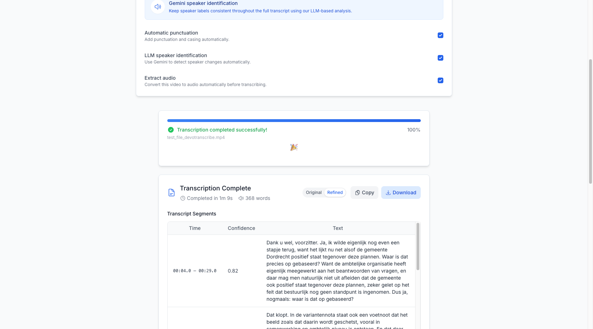

---

## 7. Viewing Results

After the transcription completes, the results page displays several sections:

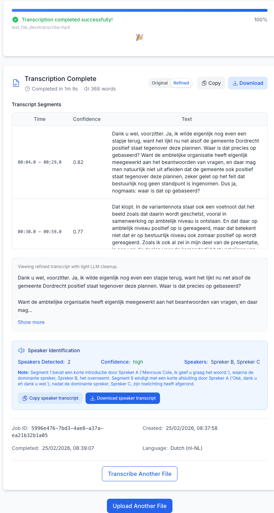

### Result Header

The header shows:
- **"Transcription Complete"** title
- **Completion time** (e.g., "Completed in 1m 9s")
- **Word count** (e.g., "368 words")
- **Original / Refined** toggle to switch between transcript versions
- **Copy** and **Download** buttons

### Original vs. Refined Transcript

DevoTranscribe provides two versions of the transcript:

- **Original** - The raw transcript returned by the Google Cloud Speech API
- **Refined** - A cleaned-up version with light LLM processing for improved readability

Use the **Original** / **Refined** toggle buttons in the header to switch between views. The refined view is selected by default when available.

---

## 8. Transcript Segments

The results include a **Transcript Segments** table showing the transcription broken into time-based segments:

| Column | Description |
|--------|-------------|
| **Time** | Start and end timestamp of the segment (e.g., `00:04.0 - 00:29.0`) |
| **Confidence** | AI confidence score from 0 to 1 (e.g., `0.82`) |
| **Text** | The transcribed text for that segment |

The segments table is scrollable for longer transcriptions.

Below the segments table, the full transcript text is displayed in a grey box. If the transcript is long, it shows a preview with a **"Show more"** button to expand the full text.

---

## 9. Speaker Identification

When speaker identification is enabled, a blue **Speaker Identification** panel appears below the transcript.

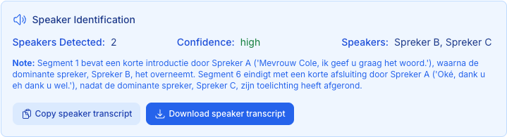

This panel shows:

- **Speakers Detected** - Number of unique speakers found (e.g., 2)
- **Confidence** - Overall confidence level (high / medium / low)
- **Speakers** - List of identified speakers (e.g., "Spreker B, Spreker C")
- **Note** - Additional context about speaker transitions and patterns

### Speaker Transcript Actions

Two dedicated buttons are provided for the speaker-identified transcript:

- **Copy speaker transcript** - Copies the speaker-labeled transcript to your clipboard
- **Download speaker transcript** - Downloads a `.txt` file with speaker labels

---

## 10. Downloading and Copying Transcripts

### Copy to Clipboard

Click the **Copy** button in the result header to copy the currently displayed transcript (Original or Refined) to your clipboard. A green "Copied" confirmation appears briefly.

### Download as Text File

Click the **Download** button to save the transcript as a `.txt` file. The filename follows the format:
- `transcript-<job-id>.txt` (original)
- `transcript-<job-id>-refined.txt` (refined)
- `transcript-<job-id>-speakers.txt` (speaker-identified)

### Job Metadata

At the bottom of the results, job metadata is displayed for reference:

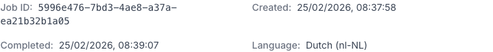

- **Job ID** - Unique identifier for the transcription job
- **Created** - Timestamp when the job was created
- **Completed** - Timestamp when the job finished
- **Language** - The transcription language (Dutch / nl-NL)

> **Tip:** Save the Job ID when contacting support about a specific transcription.

---

## 11. Starting a New Transcription

After viewing results, you can start a new transcription in two ways:

- **"Transcribe Another File"** button - Located at the bottom of the results card
- **"Upload Another File"** button - Located below the results section

Both buttons reset the page to the initial state, clearing all previous results and resetting configuration options to defaults.

---

## 12. Support & Legal Pages

The footer at the bottom of every page provides links to three additional pages:

### Privacy Policy

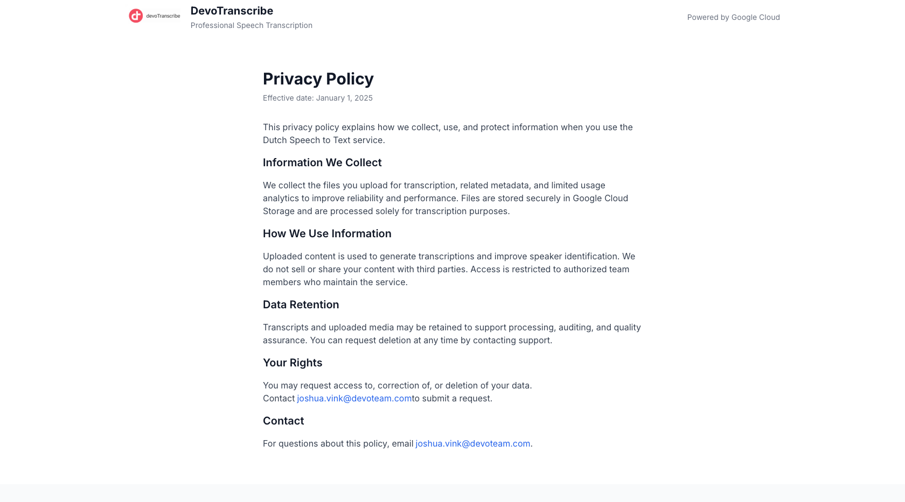

The Privacy Policy explains how DevoTranscribe collects, uses, and protects your information. Key points:

- Files are stored securely in Google Cloud Storage
- Content is processed solely for transcription purposes
- No data is sold or shared with third parties
- You can request data deletion at any time

### Terms of Service

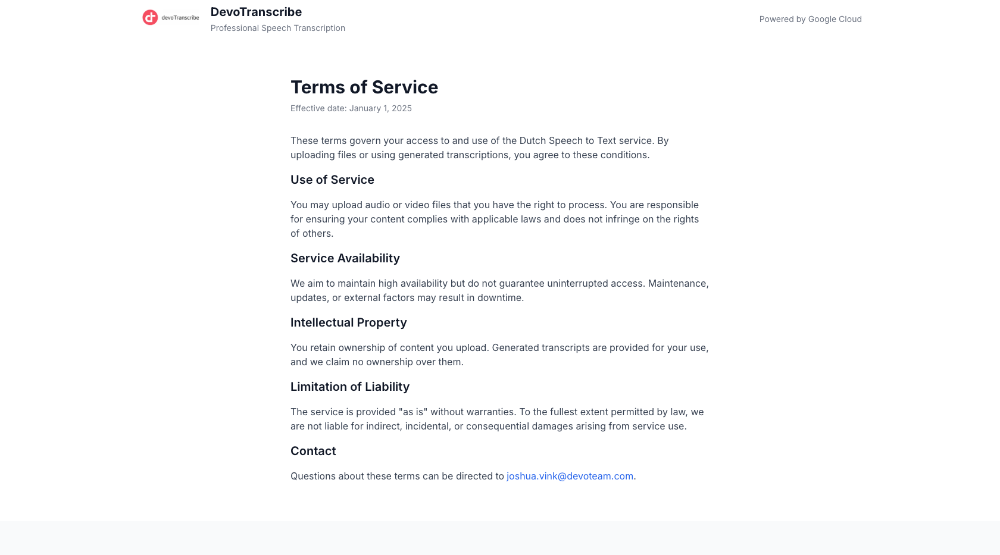

The Terms of Service cover:

- Acceptable use of the service
- Service availability expectations
- Intellectual property (you retain ownership of your content)
- Limitation of liability

### Support

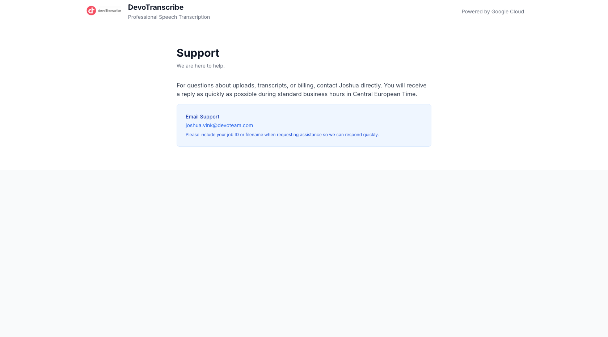

For questions about uploads, transcripts, or any issues, contact support via email:

**Email:** joshua.vink@devoteam.com

> **Tip:** Include your **Job ID** or **filename** when contacting support to help resolve issues quickly.

---

## 13. Troubleshooting

### Common Issues

| Problem | Solution |
|---------|----------|
| File upload fails | Ensure your file is a supported format and under 5GB. Try again on a stable internet connection. |
| Transcription takes too long | Larger files take longer to process. Video files require audio extraction first, which adds time. |
| Poor transcription quality | Ensure the audio has clear speech and minimal background noise. The service is optimized for Dutch (nl-NL). |
| Speaker identification seems inaccurate | Speaker identification works best with clearly distinct voices and minimal overlap. Adjust the speaker count settings if needed. |
| Configuration options are greyed out | Options are disabled during active uploads or transcriptions. Wait for the current job to complete. |
| Page refreshed during transcription | DevoTranscribe saves pending transcription state. If a session is interrupted, the app attempts to recover the job status. |

### Browser Requirements

DevoTranscribe works best with modern browsers:
- Google Chrome (recommended)
- Mozilla Firefox
- Microsoft Edge
- Safari

---

*Made by Joshua Vink - Powered by Google Cloud*
